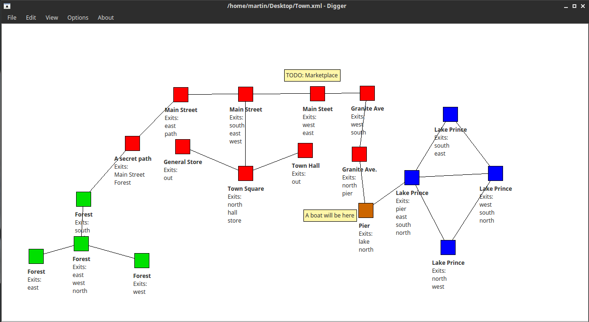

# Digger
Design MUSH worlds through a graphical interface.

This is a program to design, edit and save MUSH worlds (rooms, exits) using a graphical interface, without requiring any softcoding skills.

Currently it can only be exported to
[PennMUSH](https://github.com/pennmush/pennmush) mushcode.

## Features

* Create, edit and describe individual rooms.

	* Rooms can be color coded

* Connect rooms with exits

	* Custom aliases

* No mushcode required

* Exports to XML and mushcode

* Labels

	* Add titles; store notes, TODOs, and more.

## Running

To run Digger, you need to install python on your system and Qt4.

On Ubuntu:

`sudo apt-get install python-qt4`

`python digger.py`
